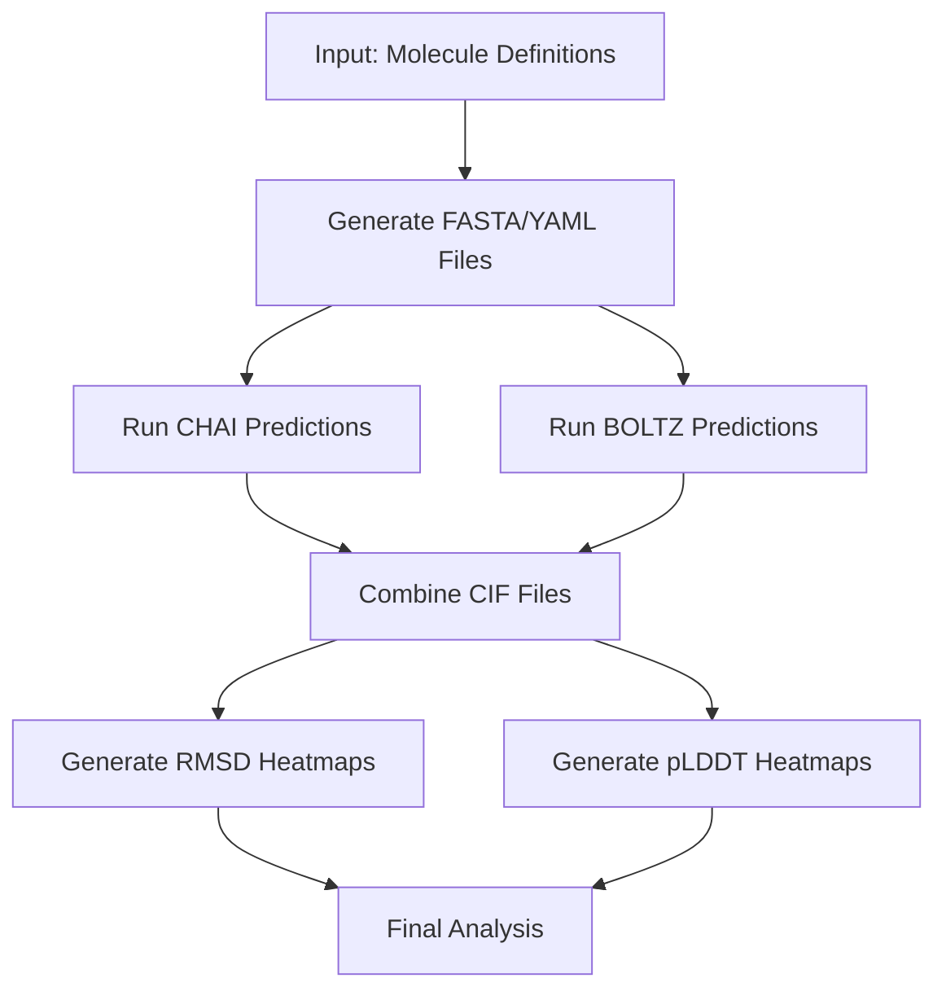

# Protein Prediction Pipeline: Integration Overview

This document provides a high-level overview of the protein prediction pipeline, explaining how the various components work together to predict and analyze protein structures.

## Pipeline Purpose

The protein prediction pipeline is designed to automate the process of predicting protein structures using multiple prediction methods (CHAI and BOLTZ), with or without Multiple Sequence Alignment (MSA), and to analyze and visualize the results. The pipeline handles the entire workflow from input preparation to visualization of results.

## Workflow Diagram



## File Overview

| File | Description |
|------|-------------|
| **run_pipeline.py** | Main orchestration script that runs the entire pipeline |
| **config_loader.py** | Loads and manages configuration from pipeline_config.json |
| **archive_and_clean.py** | Archives previous outputs and creates fresh directories |
| **generate_chai_fasta.py** | Generates FASTA files for CHAI predictions |
| **generate_boltz_yaml.py** | Generates YAML files for BOLTZ predictions |
| **run_chai_apptainer.py** | Runs CHAI protein structure prediction using Apptainer |
| **run_boltz_apptainer.py** | Runs BOLTZ protein structure prediction using Apptainer |
| **combine_cif_files.py** | Creates PyMOL session files and calculates RMSD values |
| **plot_rmsd_heatmap.py** | Generates heatmap visualizations of RMSD values |
| **plot_plddt_heatmap.py** | Generates heatmap visualizations of pLDDT values |
| **pipeline_config.json** | Configuration file for the pipeline |

## Data Flow and Integration

### 1. Configuration and Setup

The pipeline begins with **run_pipeline.py**, which loads configuration from **pipeline_config.json** using **config_loader.py**. The configuration defines directories, methods to use, templates, and visualization parameters.

Before starting a new run, **archive_and_clean.py** is called to archive previous outputs, copy configuration files (molecules.json and pipeline_config.json) to the archive for reference, and create fresh directories for the new run.

### 2. Input Preparation

Based on molecule definitions in a JSON file:

- **generate_chai_fasta.py** creates FASTA files for CHAI predictions
- **generate_boltz_yaml.py** creates YAML files for BOLTZ predictions

These files are organized in directory structures that match the molecule names.

### 3. Structure Prediction

If enabled in the configuration:

- **run_chai_apptainer.py** processes each FASTA file and runs the CHAI prediction tool
- **run_boltz_apptainer.py** processes each YAML file and runs the BOLTZ prediction tool

Both scripts support MSA-based predictions and skip files that have already been processed.

### 4. Analysis and Visualization

After predictions are complete:

- **combine_cif_files.py** finds protein structures from both CHAI and BOLTZ outputs, loads them into PyMOL, aligns them to templates, calculates RMSD values, and creates PyMOL session files (.pse)
- **plot_rmsd_heatmap.py** reads RMSD values from CSV files and creates heatmap visualizations
- **plot_plddt_heatmap.py** extracts pLDDT values from JSON files and creates heatmap visualizations

### 5. Output Organization

The pipeline organizes outputs in a structured directory hierarchy:

- **CHAI_FASTA/**: FASTA files for CHAI predictions
- **BOLTZ_YAML/**: YAML files for BOLTZ predictions
- **OUTPUT/CHAI/**: CHAI prediction results
- **OUTPUT/BOLTZ/**: BOLTZ prediction results
- **PSE_FILES/**: PyMOL session files
- **plots/**: Heatmap visualizations
- **csv/**: CSV files with RMSD and pLDDT values
- **archive_[timestamp]/**: Archive directories containing:
  - Previous run outputs
  - Copies of configuration files (molecules.json and pipeline_config.json)

## Configuration and Customization

The pipeline is highly configurable through **pipeline_config.json** and command-line arguments. Key configuration options include:

- **Directories**: Paths for inputs, outputs, and intermediate files
- **Methods**: Which prediction methods to use (CHAI, BOLTZ, MSA)
  - By default, both CHAI and BOLTZ are enabled
  - MSA is enabled by default, but the MSA directory option is disabled by default
- **Templates**: Template files for structural comparison
- **Visualization**: Parameters for heatmap visualizations

Default configuration from pipeline_config.json:
```json
{
  "methods": {
    "use_chai": true,
    "use_boltz": true,
    "use_msa": true,
    "use_msa_dir": false
  }
}
```

## Pipeline Execution

The pipeline can be run with a single command:

```bash
python run_pipeline.py
```

### Command-line Options

The pipeline supports a comprehensive set of command-line options for customization:

#### Configuration Options
- `--config CONFIG_FILE`: Specify a custom configuration file (default: pipeline_config.json)

#### Archiving Options
- `--no-archive`: Delete previous outputs without archiving

#### Pipeline Flow Control
- `--skip-step STEP`: Skip a specific step in the pipeline. Can be used multiple times.
  - Valid steps: archive, chai-fasta, boltz-yaml, chai-run, boltz-run, combine-cif, rmsd-plot, plddt-plot
- `--resume`: Resume pipeline from the last failed step
- `--force-resume`: Force resume even if configuration has changed
- `--state-file STATE_FILE`: Specify a custom pipeline state file (default: pipeline_state.json)
- `--clean-state`: Clean the state file before starting

#### Method Selection
- `--use-chai`: Use CHAI for predictions (default: enabled)
- `--no-chai`: Do not use CHAI for predictions
- `--use-boltz`: Use BOLTZ for predictions (default: enabled)
- `--no-boltz`: Do not use BOLTZ for predictions
- `--use-msa`: Use MSA for predictions (default: enabled)
- `--no-msa`: Do not use MSA for predictions
- `--use-msa-dir`: Use MSA directory for CHAI (default: disabled)

#### Directory Options
- `--chai-fasta DIR`: CHAI FASTA directory (default: CHAI_FASTA)
- `--boltz-yaml DIR`: BOLTZ YAML directory (default: BOLTZ_YAML)
- `--chai-output DIR`: CHAI output directory (default: OUTPUT/CHAI)
- `--boltz-output DIR`: BOLTZ output directory (default: OUTPUT/BOLTZ)
- `--pse-files DIR`: PSE files directory (default: PSE_FILES)
- `--plots DIR`: Plots directory (default: plots)
- `--csv DIR`: CSV files directory (default: csv)

#### Template Options
- `--template FILE`: Template file (default: from config)
- `--model-idx N`: Model index to search for (default: from config)

#### Output Control
- `--quiet`: Suppress detailed output

### Example Commands

```bash
# Run with default settings
python run_pipeline.py

# Skip archiving and use only CHAI with MSA
python run_pipeline.py --no-archive --use-chai --no-boltz --use-msa

# Resume a failed pipeline run
python run_pipeline.py --resume

# Skip specific steps
python run_pipeline.py --skip-step chai-fasta --skip-step boltz-yaml

# Use a custom template and model index
python run_pipeline.py --template custom_template.cif --model-idx 2

# Use custom directories
python run_pipeline.py --chai-fasta custom_fasta --boltz-yaml custom_yaml --plots custom_plots
```

The pipeline uses state tracking, allowing it to resume from failures without rerunning completed steps. This is particularly useful for long-running predictions that may encounter temporary issues.
