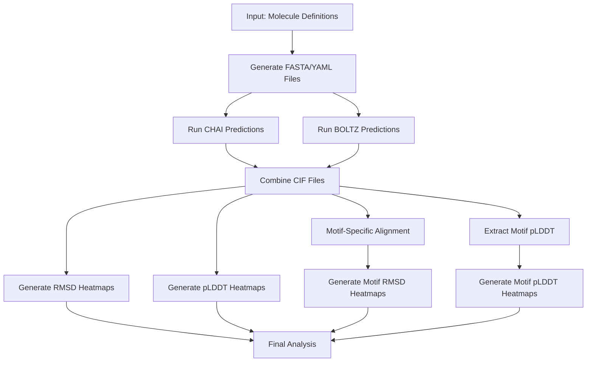

# Protein Prediction Pipeline: Integration Overview

This document provides a high-level overview of the protein prediction pipeline, explaining how the various components work together to predict and analyze protein structures.

## Pipeline Purpose

The protein prediction pipeline is designed to automate the process of predicting protein structures using multiple prediction methods (CHAI and BOLTZ), with or without Multiple Sequence Alignment (MSA), and to analyze and visualize the results. The pipeline handles the entire workflow from input preparation to visualization of results.

## Workflow Diagram



## File Overview

| File | Description |
|------|-------------|
| **run_pipeline.py** | Main orchestration script that runs the entire pipeline |
| **config_loader.py** | Loads and manages configuration from pipeline_config.json |
| **archive_and_clean.py** | Archives previous outputs and creates fresh directories |
| **generate_chai_fasta.py** | Generates FASTA files for CHAI predictions |
| **generate_boltz_yaml.py** | Generates YAML files for BOLTZ predictions |
| **run_chai_apptainer.py** | Runs CHAI protein structure prediction using Apptainer |
| **run_boltz_apptainer.py** | Runs BOLTZ protein structure prediction using Apptainer |
| **combine_cif_files.py** | Creates PyMOL session files and calculates RMSD values |
| **plot_rmsd_heatmap.py** | Generates heatmap visualizations of RMSD values |
| **plot_plddt_heatmap.py** | Generates heatmap visualizations of pLDDT values |
| **motif_alignment.py** | Performs motif-specific alignment and RMSD calculation |
| **extract_motif_plddt.py** | Extracts pLDDT values for specific motifs |
| **plot_motif_rmsd.py** | Generates heatmap visualizations of motif-specific RMSD values |
| **plot_motif_plddt.py** | Generates heatmap visualizations of motif-specific pLDDT values |
| **pipeline_config.json** | Configuration file for the pipeline |

## Data Flow and Integration

### 1. Configuration and Setup

The pipeline begins with **run_pipeline.py**, which loads configuration from **pipeline_config.json** using **config_loader.py**. The configuration defines directories, methods to use, templates, and visualization parameters.

Before starting a new run, **archive_and_clean.py** is called to archive previous outputs, copy configuration files (molecules.json and pipeline_config.json) to the archive for reference, and create fresh directories for the new run.

### 2. Input Preparation

Based on molecule definitions in a JSON file:

- **generate_chai_fasta.py** creates FASTA files for CHAI predictions
- **generate_boltz_yaml.py** creates YAML files for BOLTZ predictions

These files are organized in directory structures that match the molecule names.

### 3. Structure Prediction

If enabled in the configuration:

- **run_chai_apptainer.py** processes each FASTA file and runs the CHAI prediction tool
- **run_boltz_apptainer.py** processes each YAML file and runs the BOLTZ prediction tool

Both scripts support MSA-based predictions and skip files that have already been processed.

### 4. Analysis and Visualization

After predictions are complete:

- **combine_cif_files.py** finds protein structures from both CHAI and BOLTZ outputs, loads them into PyMOL, aligns them to templates, calculates RMSD values, and creates PyMOL session files (.pse)
- **plot_rmsd_heatmap.py** reads RMSD values from CSV files and creates heatmap visualizations
- **plot_plddt_heatmap.py** extracts pLDDT values from JSON files and creates heatmap visualizations

### 5. Motif-Specific Analysis

The pipeline includes specialized tools for analyzing specific regions (motifs) of proteins:

- **motif_alignment.py** performs alignment and RMSD calculation focused only on specific motif regions:
  - Takes protein structures and motif definitions from the configuration
  - Extracts the specified motif regions (e.g., binding pockets, active sites)
  - Performs alignment on just those regions
  - Calculates motif-specific RMSD values
  - Creates specialized PyMOL session files that highlight the motif regions
  - Saves these files in PSE_FILES/motifs/[motif_id]/

- **extract_motif_plddt.py** extracts pLDDT values for specific motifs:
  - Finds all JSON files with pLDDT values
  - Extracts pLDDT values for the specified motif residues
  - Calculates average pLDDT values for the motif regions

- **plot_motif_rmsd.py** and **plot_motif_plddt.py** generate heatmap visualizations:
  - Create specialized heatmaps focused on motif-specific metrics
  - Allow comparison of prediction methods specifically for critical regions

Motifs are defined in the configuration file under the "motifs" section:

```json
"motifs": {
  "definitions": [
    {
      "id": "binding_pocket_hM1D",
      "description": "Ligand binding pocket residues for hM1Dshort_8E9X",
      "molecules": ["hM1Dshort_8E9X"],
      "residues": [112, 113, 116, 117, 120, 164, 196, 199, 200, 203, 204, 413, 416, 417, 420, 439, 442, 443],
      "chain": "A",
      "color": "magenta",
      "template": "templates/hM1D_template_8E9X.cif",
      "model_idx": 4
    },
    {
      "id": "whole_protein_hM1D",
      "description": "Complete protein structure for hM1Dshort_8E9X",
      "molecules": ["hM1Dshort_8E9X"],
      "whole_protein": true,
      "chain": "A",
      "color": "cyan",
      "template": "templates/hM1D_template_8E9X.cif",
      "model_idx": 4
    }
  ]
}
```

The pipeline now supports two types of motifs:

1. **Binding Pocket Motifs**: Define specific residues for analysis
   - Specified by a list of residue numbers in the `residues` field
   - Used for focused analysis of functionally important regions

2. **Whole Protein Motifs**: Analyze the entire protein structure
   - Specified by setting `whole_protein: true`
   - Used for comprehensive analysis of the entire protein

Each motif can have its own specific template file and model index, allowing for molecule-specific templates.

### 6. Output Organization

The pipeline organizes outputs in a structured directory hierarchy:

- **CHAI_FASTA/**: FASTA files for CHAI predictions
- **BOLTZ_YAML/**: YAML files for BOLTZ predictions
- **OUTPUT/CHAI/**: CHAI prediction results
- **OUTPUT/BOLTZ/**: BOLTZ prediction results
- **PSE_FILES/**: PyMOL session files
  - **PSE_FILES/motifs/[motif_id]/**: Motif-specific PyMOL session files
- **plots/**: Heatmap visualizations
  - Contains both whole-protein and motif-specific heatmaps
- **csv/**: CSV files with RMSD and pLDDT values
  - Contains both whole-protein and motif-specific data
- **archive_[timestamp]/**: Archive directories containing:
  - Previous run outputs
  - Copies of configuration files (molecules.json and pipeline_config.json)

## Configuration and Customization

The pipeline is highly configurable through **pipeline_config.json** and command-line arguments.

### Configuration Structure

The configuration file has three main sections:

1. **Global Settings**: Common settings shared across all runs
2. **Prediction Runs**: Multiple specific prediction configurations
3. **Analysis Runs**: Multiple specific analysis configurations

```json
{
  "global": {
    "directories": { ... },
    "model_idx": 4,
    "visualization": { ... },
    "motifs": {
      "definitions": [ ... ]
    }
  },
  "prediction_runs": [
    {
      "id": "standard",
      "description": "Standard run without MSA",
      "enabled": true,
      "methods": {
        "use_chai": true,
        "use_boltz": true,
        "use_msa": false,
        "use_msa_dir": false
      }
    },
    {
      "id": "with_msa",
      "description": "Run with MSA enabled",
      "enabled": true,
      "methods": {
        "use_chai": true,
        "use_boltz": true,
        "use_msa": true,
        "use_msa_dir": false
      }
    }
  ],
  "analysis_runs": [
    {
      "id": "whole_protein_hM1D_analysis",
      "description": "Whole protein analysis for hM1D",
      "enabled": true,
      "source_predictions": ["standard", "with_msa"],
      "analysis_type": "motif",
      "motif_id": "whole_protein_hM1D",
      "metrics": ["rmsd", "plddt"]
    },
    {
      "id": "binding_pocket_hM1D_analysis",
      "description": "Binding pocket motif analysis for hM1D",
      "enabled": true,
      "source_predictions": ["standard", "with_msa"],
      "analysis_type": "motif",
      "motif_id": "binding_pocket_hM1D",
      "metrics": ["rmsd", "plddt"]
    }
  ]
}
```

### Key Configuration Options

- **Directories**: Paths for inputs, outputs, and intermediate files
- **Methods**: Which prediction methods to use (CHAI, BOLTZ, MSA)
- **Motifs**: Definitions of protein regions for targeted analysis
- **Templates**: Template files for structural comparison (now defined per motif)
- **Visualization**: Parameters for heatmap visualizations

### Default Configurations

By default, the pipeline includes two prediction runs:

1. **standard**: Runs without MSA
2. **with_msa**: Runs with MSA enabled

And multiple analysis runs for different motifs and molecules.

## Pipeline Execution

The pipeline can be run with a single command:

```bash
python run_pipeline.py
```

### Command-line Options

The pipeline supports a comprehensive set of command-line options for customization:

#### Configuration Options
- `--config CONFIG_FILE`: Specify a custom configuration file (default: pipeline_config.json)
- `--prediction-runs PRED_IDS`: Comma-separated list of prediction run IDs to run (default: all enabled)
- `--analysis-runs ANALYSIS_IDS`: Comma-separated list of analysis run IDs to run (default: all enabled)
- `--enable-prediction PRED_ID`: Enable a specific prediction run (can be used multiple times)
- `--disable-prediction PRED_ID`: Disable a specific prediction run (can be used multiple times)
- `--enable-analysis ANALYSIS_ID`: Enable a specific analysis run (can be used multiple times)
- `--disable-analysis ANALYSIS_ID`: Disable a specific analysis run (can be used multiple times)

#### Archiving Options
- `--no-archive`: Skip archiving previous outputs (keep existing files)
- `--delete-outputs`: Delete previous outputs without archiving

#### Pipeline Flow Control
- `--skip-step STEP`: Skip a specific step in the pipeline. Can be used multiple times.
  - Valid steps: archive, chai-fasta, boltz-yaml, chai-run, boltz-run, combine-cif, rmsd-plot, plddt-plot, motif-align, motif-rmsd, motif-plddt
- `--resume`: Resume pipeline from the last failed step
- `--force-resume`: Force resume even if configuration has changed
- `--state-file STATE_FILE`: Specify a custom pipeline state file (default: pipeline_state.json)
- `--clean-state`: Clean the state file before starting

#### Method Selection
- `--use-chai`: Use CHAI for predictions (default: enabled)
- `--no-chai`: Do not use CHAI for predictions
- `--use-boltz`: Use BOLTZ for predictions (default: enabled)
- `--no-boltz`: Do not use BOLTZ for predictions
- `--use-msa`: Use MSA for predictions (default: enabled)
- `--no-msa`: Do not use MSA for predictions
- `--use-msa-dir`: Use MSA directory for CHAI (default: disabled)

#### Directory Options
- `--chai-fasta DIR`: CHAI FASTA directory (default: CHAI_FASTA)
- `--boltz-yaml DIR`: BOLTZ YAML directory (default: BOLTZ_YAML)
- `--chai-output DIR`: CHAI output directory (default: OUTPUT/CHAI)
- `--boltz-output DIR`: BOLTZ output directory (default: OUTPUT/BOLTZ)
- `--pse-files DIR`: PSE files directory (default: PSE_FILES)
- `--plots DIR`: Plots directory (default: plots)
- `--csv DIR`: CSV files directory (default: csv)

#### Template Options
- `--template FILE`: Template file (default: from config)
- `--model-idx N`: Model index to search for (default: from config)

#### Motif Options
- `--motif MOTIF_ID`: Motif ID to use for analysis

#### Output Control
- `--quiet`: Suppress detailed output

### Example Commands

```bash
# Run with default settings (all enabled prediction and analysis runs)
python run_pipeline.py

# Run only specific prediction runs
python run_pipeline.py --prediction-runs standard,with_msa

# Run only specific analysis runs
python run_pipeline.py --analysis-runs whole_protein_hM1D_analysis,binding_pocket_hM1D_analysis

# Enable specific prediction and analysis runs
python run_pipeline.py --enable-prediction standard --disable-prediction with_msa --enable-analysis whole_protein_hM1D_analysis

# Skip archiving and use only CHAI
python run_pipeline.py --no-archive --use-chai --no-boltz

# Resume a failed pipeline run
python run_pipeline.py --resume

# Skip specific steps
python run_pipeline.py --skip-step chai-fasta --skip-step boltz-yaml

# Use a custom template and model index
python run_pipeline.py --template custom_template.cif --model-idx 2

# Use custom directories
python run_pipeline.py --chai-fasta custom_fasta --boltz-yaml custom_yaml --plots custom_plots
```

The pipeline uses state tracking, allowing it to resume from failures without rerunning completed steps. This is particularly useful for long-running predictions that may encounter temporary issues.
