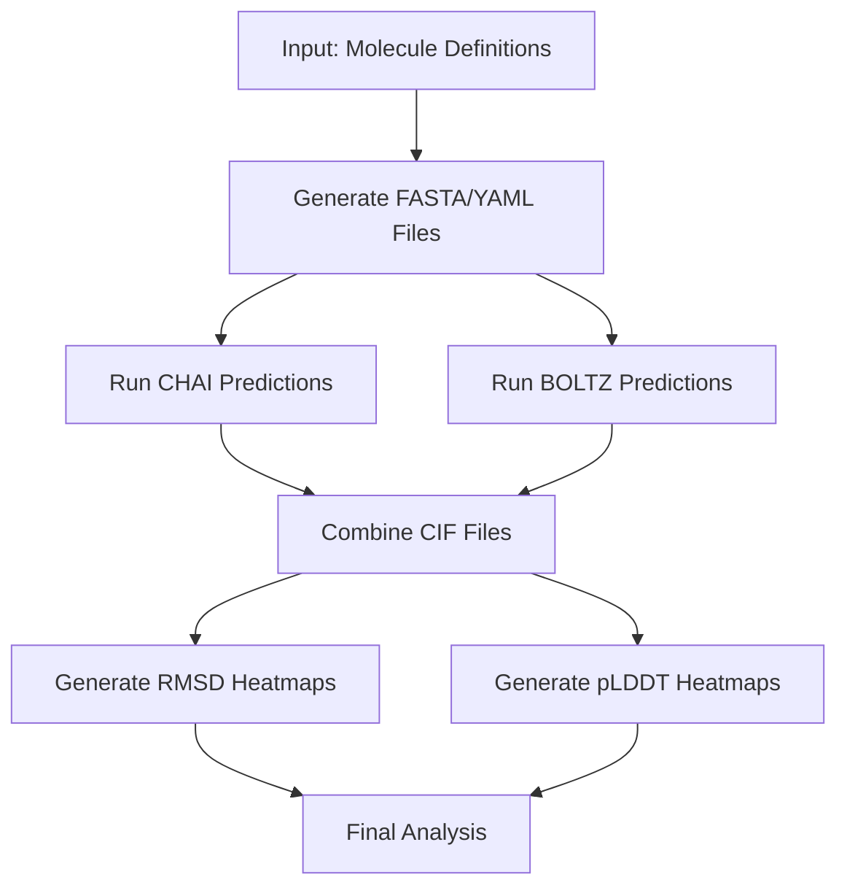

# Protein Prediction Pipeline: Integration Overview

This document provides a high-level overview of the protein prediction pipeline, explaining how the various components work together to predict and analyze protein structures.

## Pipeline Purpose

The protein prediction pipeline is designed to automate the process of predicting protein structures using multiple prediction methods (CHAI and BOLTZ), with or without Multiple Sequence Alignment (MSA), and to analyze and visualize the results. The pipeline handles the entire workflow from input preparation to visualization of results.

## Workflow Diagram



## File Overview

| File | Description |
|------|-------------|
| **run_pipeline.py** | Main orchestration script that runs the entire pipeline |
| **config_loader.py** | Loads and manages configuration from pipeline_config.json |
| **archive_and_clean.py** | Archives previous outputs and creates fresh directories |
| **generate_chai_fasta.py** | Generates FASTA files for CHAI predictions |
| **generate_boltz_yaml.py** | Generates YAML files for BOLTZ predictions |
| **run_chai_apptainer.py** | Runs CHAI protein structure prediction using Apptainer |
| **run_boltz_apptainer.py** | Runs BOLTZ protein structure prediction using Apptainer |
| **combine_cif_files.py** | Creates PyMOL session files and calculates RMSD values |
| **plot_rmsd_heatmap.py** | Generates heatmap visualizations of RMSD values |
| **plot_plddt_heatmap.py** | Generates heatmap visualizations of pLDDT values |
| **pipeline_config.json** | Configuration file for the pipeline |

## Data Flow and Integration

### 1. Configuration and Setup

The pipeline begins with **run_pipeline.py**, which loads configuration from **pipeline_config.json** using **config_loader.py**. The configuration defines directories, methods to use, templates, and visualization parameters.

Before starting a new run, **archive_and_clean.py** is called to archive previous outputs and create fresh directories for the new run.

### 2. Input Preparation

Based on molecule definitions in a JSON file:

- **generate_chai_fasta.py** creates FASTA files for CHAI predictions
- **generate_boltz_yaml.py** creates YAML files for BOLTZ predictions

These files are organized in directory structures that match the molecule names.

### 3. Structure Prediction

If enabled in the configuration:

- **run_chai_apptainer.py** processes each FASTA file and runs the CHAI prediction tool
- **run_boltz_apptainer.py** processes each YAML file and runs the BOLTZ prediction tool

Both scripts support MSA-based predictions and skip files that have already been processed.

### 4. Analysis and Visualization

After predictions are complete:

- **combine_cif_files.py** finds protein structures from both CHAI and BOLTZ outputs, loads them into PyMOL, aligns them to templates, calculates RMSD values, and creates PyMOL session files (.pse)
- **plot_rmsd_heatmap.py** reads RMSD values from CSV files and creates heatmap visualizations
- **plot_plddt_heatmap.py** extracts pLDDT values from JSON files and creates heatmap visualizations

### 5. Output Organization

The pipeline organizes outputs in a structured directory hierarchy:

- **CHAI_FASTA/**: FASTA files for CHAI predictions
- **BOLTZ_YAML/**: YAML files for BOLTZ predictions
- **OUTPUT/CHAI/**: CHAI prediction results
- **OUTPUT/BOLTZ/**: BOLTZ prediction results
- **PSE_FILES/**: PyMOL session files
- **plots/**: Heatmap visualizations
- **csv/**: CSV files with RMSD and pLDDT values

## Configuration and Customization

The pipeline is highly configurable through **pipeline_config.json** and command-line arguments. Key configuration options include:

- **Directories**: Paths for inputs, outputs, and intermediate files
- **Methods**: Which prediction methods to use (CHAI, BOLTZ, MSA)
- **Templates**: Template files for structural comparison
- **Visualization**: Parameters for heatmap visualizations

## Pipeline Execution

The pipeline can be run with a single command:

```bash
python run_pipeline.py
```

It supports various command-line options for customization, including:

- Skipping specific steps
- Using different templates
- Resuming from failures
- Controlling output verbosity

The pipeline also supports state tracking, allowing it to resume from failures without rerunning completed steps.
